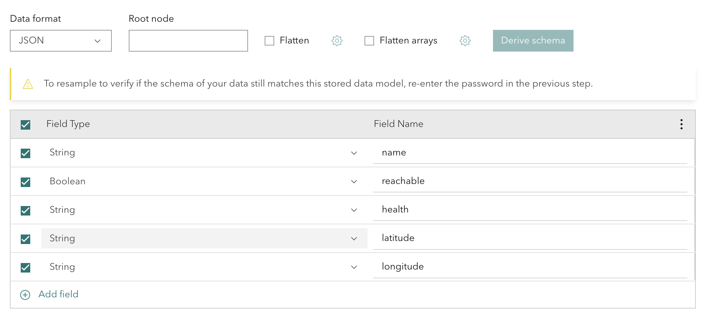

# Python project to pull router status from Cisco Catalyst SD-WAN Manager and push into ESRI ArcGIS via MQTT and Velocity

A project by Pete Kavanagh

## Instructions

1. Create a "login.json" file inside an "env" directory.
login.json file has to be in this format:
```
{
    "csm" : {
        "url" : "<vManage URL / IP>",
        "username" : "<username>",
        "password" : "<password>"
    },
    "mqttbroker" : {
        "url" : "<MQTT URL>",
        "port" : "<MQTT port, e.g. 8883>",
        "tls" : <true or false>,
        "username" : "<username>",
        "password" : "<password>"
    }
}
```

2. Run the pullrouterstatus.py script and once you see it is getting the correct data, log into your MQTT broker or use an MQTT client to subscribe to the feed and confirm data is being receieved.  Published path is "catalystsdwanmanager/<CSM>", where CSM is the IP address of FQDN you supplied in the login.json file.

3. Use https://velocity.arcgis.com/ to ingest MQTT and map fields from JSON (ref https://doc.arcgis.com/en/iot/ingest/json.htm)


## Dev Notes:
docker run -v ${PWD}/app:/app -w /app python:3.12-alpine3.20 sh -c "pip install catalystwan"
https://github.com/cisco-open/cisco-catalyst-wan-sdk

    #devices = session.api.devices.get()
    #users = session.api.users.get()
    #info = session.endpoints.monitoring_server_info.get_server_info()